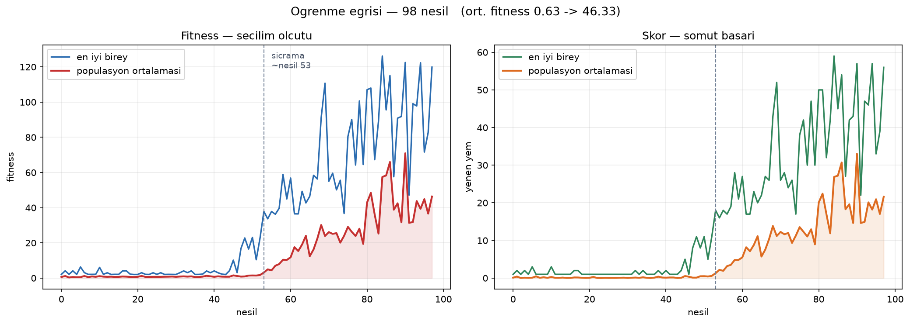
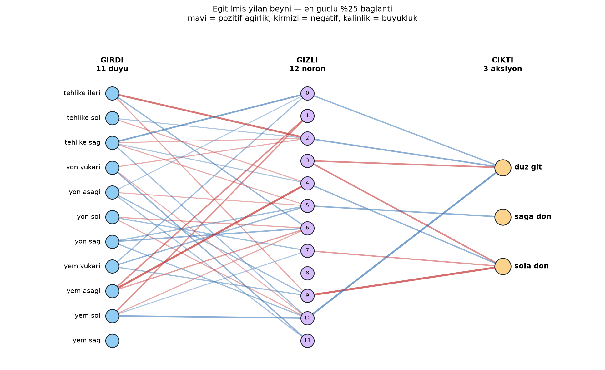

# Snake Evolution

Genetik algoritma ile kendi kendine yılan oynamayı öğrenen sinir ağı ajanı. Backpropagation yok — ağırlıklar nesiller boyunca seçilim, çaprazlama ve mutasyonla evrimleşiyor.



100 nesilde ortalama fitness 0.60 → 35.98. Duyu vektörü 14 sayı, ağ 219 parametre.

---

## Kurulum

```bash
python3 -m venv venv
source venv/bin/activate          # Windows: venv\Scripts\activate
pip install -r requirements.txt
```

## Çalıştırma

| Komut | Ne yapar |
|---|---|
| `python train.py` | Ekransız eğitim. Checkpoint varsa kaldığı nesilden devam eder. |
| `python train.py --fresh` | Checkpoint'i yok sayar, sıfırdan başlar. |
| `python evolve_live.py` | Evrimi ekranda izle — nesiller ilerledikçe yılanlar iyileşir. |
| `python main.py` | Kaydedilmiş en iyi beyni izle. |
| `python plot_history.py` | Öğrenme eğrisini çiz. |
| `python visualize.py` | Ağırlık haritasını çiz (statik PNG). |
| `python genelleme_testi.py` | Modelleri görülmemiş tohumlarda karşılaştır. |
| `python test_game.py` | Oyun motorunun doğruluk testleri. |

Tuşlar: `P` duraklat · `SPACE` hız · `TAB` ağ görünümü · `N` nesli atla · `I` çık

Eğitim `Ctrl+C` ile kesilirse son durum kaydedilir. Tüm ayarlar `config.py` içinde.

---

## Mimari

Üç ayrım projenin tamamını belirledi:

**Mantık ≠ görüntü.** `core/game.py` içinde tek bir pygame satırı yok. Eğitim tamamen ekransız koşuyor — 100 birey × 100 nesil dakikalar alıyor, ekrana çizilseydi saatler sürerdi.

**Ortam ≠ ajan.** `agents/base.py` bir sözleşme tanımlıyor: durum ver, aksiyon al. `RandomAgent` ve `NeuralAgent` aynı yerden takılıyor; sinir ağı eklenirken motorda tek satır değişmedi.

**Kod ≠ ayar.** Hiperparametrelerin tamamı `config.py`'da. Deney yapmak tek satır değiştirmek.

```
core/       oyun motoru + sabitler   (pygame YOK)
agents/     ajan sözleşmesi, rastgele ajan, sinir ağı
evolution/  fitness, popülasyon, genetik operatörler
render/     çizim + canlı ağ görünümü
```

---

## Yöntem

### Duyu vektörü (14 sayı)

| Grup | İçerik |
|---|---|
| Tehlike (3) | önde / sağda / solda ölüm var mı (0 veya 1) |
| Boş alan (3) | o yöne gidilirse erişilebilir boş hücre oranı |
| Yön (4) | yılan hangi yöne bakıyor (one-hot) |
| Yem (4) | yem başa göre yukarıda / aşağıda / solda / sağda mı |

Ham koordinat (`baş=(7,3)`, `yem=(2,9)`) yerine bu sinyaller veriliyor. İki sebeple: ağın öğrenmesi gereken şey azalıyor, ve öğrenilen kural tahta boyutundan bağımsız kalıyor.

Yön için tek sayı (0-3) yerine dört ayrı kutu kullanılıyor — tek sayı verilse ağ "sağ (3), yukarıdan (0) üç kat fazla bir şey" gibi anlamsız bir sıra ilişkisi kurardı.

**Boş alan sayacı flood fill ile hesaplanıyor**, düz sayımla değil. Koridora girip sağa dönebiliyorsan o alan da erişilebilir; düz sayım bunu göremez. Değerler toplam hücre sayısına bölünüp normalize ediliyor — ham sayı 87 olurken diğer duyular 0-1 arasında kalsaydı ağ için dengesiz olurdu.

### Ağ

`14 → 12 → 3`, gizli katmanda `tanh`. Toplam **219 parametre**.

`tanh` olmadan iki matris çarpımı matematiksel olarak tek matrise çöker ve gizli katman işlevsiz kalır. Gizli katman "önümde tehlike VAR **ve** sağımda da VAR ise sola dön" gibi bileşik kurallar için gerekli.

Çıktının en büyüğünün **indeksi** doğrudan aksiyon kodu (`GO_FORWARD=0`, `TURN_RIGHT=1`, `TURN_LEFT=2`), çeviri tablosu yok.

### Fitness

```
fitness = skor × 2.0 + adım × 0.005
```

Sadece skor kullanılsa seçilim imkânsız olurdu: ilk testte 100 yılanın 89'unun skoru 0 çıktı, hepsi eşitti. Adım terimi bu bireyleri birbirinden ayırıyor.

Katsayı kasıtlı olarak çok küçük. Şart: `maksimum_adım × katsayı < bir_yemin_değeri`. Aksi halde yılan yem yemek yerine sonsuza kadar daire çizmeyi öğrenir — ki bu gerçekten oldu, aşağıya bakın.

### Evrim (nesil başına)

1. 100 birey oynatılır, fitness'a göre sıralanır
2. En iyi 4 aynen taşınır (**elitizm**) — en iyi çözüm asla kaybedilmez
3. Kalan 96: turnuva seçilimi (k=5) → uniform crossover → mutasyon (oran 0.05, güç 0.2)

Turnuva havuzu tüm popülasyon, sadece elitler değil. Sıralamada 60. olan bir birey genel olarak kötü olsa da işe yarar bir parça taşıyabilir; çaprazlama o parçayı iyi bir genomla birleştirebilir.

Nesiller arasında taşınan **tek şey genom**. Gövde uzunluğu, skor, adım sayısı — hiçbiri taşınmaz. Her yılan sıfırdan doğar.

### Checkpoint

Eğitim kaldığı nesilden devam eder. Checkpoint'te sadece en iyi genom değil **popülasyonun tamamı** saklanır — yoksa evrim yeni bir popülasyonla baştan başlar. Rastgele üretecin iç durumu da kaydedilir, aksi halde devam eden koşu aynı diziyi baştan üretir ve tekrarlanabilirlik bozulur.

---

## Bulgular

### 1. Plato, sonra sıçrama

Öğrenme doğrusal değil. **45 nesil boyunca hiçbir yılan 2'den fazla yem yiyemedi.** Sonra:

- Nesil ~45: **tek bir birey** çözümü buldu (mavi çizgi yükselir)
- Nesil ~53: genler popülasyona yayıldı (kırmızı çizgi yükselir)

Plato boşa geçmiyor — popülasyonda işe yarar ağırlık parçaları birikiyor, bir çaprazlama doğru parçaları birleştirdiğinde çözülüyor. Nesil 30'da "çalışmıyor" deyip durdurulsaydı hiçbir şey görülmeyecekti.

En iyi birey ile ortalama arasındaki kalıcı boşluk çeşitliliğin göstergesi. Kapansaydı popülasyon tek çözüme saplanır, evrim dururdu.

### 2. Ölüm sebebi dağılımı — en öğretici bulgu

11 duyulu sürümde, nesil boyunca:

| Nesil | wall | starved | self |
|---|---|---|---|
| 0 | 60 | 38 | 2 |
| 30 | 32 | **65** | 3 |
| 60 | 30 | 23 | 47 |
| 90 | 16 | 7 | **77** |

Üç ayrı öğrenme aşaması:

**Duvardan kaçmayı öğrendiler.** `wall` 60'tan 32'ye düştü.

**Sonra daire çizmeye başladılar.** Nesil 30'da `starved` 65 — yılanlar hayatta kalmayı çözdü ama yem yemedi. Bu, adım teriminin yarattığı **ödül sömürüsü** (reward hacking): ajan istenen şeyi değil, puan verilen şeyi yapıyor.

Kendiliğinden düzeldi çünkü katsayı doğru ayarlıydı: bir yem 2 puan, 200 adım daire yalnızca 1 puan. Daire çizenler bir süre öne geçti, yem yiyenler ortaya çıkınca elendiler.

**En sonda kendilerine sıkışmaya başladılar.** `self` 77 — kendine çarpabilmek için uzun olman, uzun olmak için çok yem yemiş olman gerekiyor. Bu, aşağıdaki iyileştirmenin çıkış noktası oldu.

Tek bir fitness sayısı "iyi mi kötü mü" der; ölüm dağılımı "neden" der.

### 3. Koşular arası varyans çok yüksekti

11 duyulu sürümde, aynı ayarlar, sadece `TRAIN_SEED` farklı:

| Tohum | Nesil | Son nesil ort. | En iyi skor |
|---|---|---|---|
| 42 | 100 | 46.25 | 68 |
| 7 | 100 | **3.63** | 12 |
| 7 | 300 | 4.39 | 26 |

Tohum 7 üç kat uzun eğitimde bile tohum 42'nin 100 nesline yaklaşamadı. Sebep muhtemelen erken yakınsama: başlangıç popülasyonunda işe yarar parça yoksa çaprazlamanın birleştireceği bir şey olmuyor.

**Bu, aşağıdaki hiperparametre karşılaştırmalarının hepsini şüpheli kılıyor** — hepsi tek koşu.

### 4. Hiperparametre deneyleri (tek koşu — yukarıdaki uyarıyla okuyun)

**Gizli katman boyutu** (100 nesil, tohum 42, 11 duyu):

| Boyut | Genom | Son nesil ort. | En iyi skor |
|---|---|---|---|
| 6 | 99 | 3.29 | 8 |
| **12** | **183** | **46.25** | **68** |
| 24 | 363 | 35.52 | 34 |

6'da ağ kapasitesi bileşik kurallara yetmiyor. 24'te genom iki katına çıktığı için genetik algoritma aynı nesil sayısında yakınsayamıyor.

**Mutasyon oranı** (100 nesil, tohum 42, 11 duyu):

| Oran | Son nesil ort. | En iyi skor |
|---|---|---|
| 0.01 | **62.91** | 33 |
| **0.05** | 46.25 | **68** |
| 0.15 | 49.95 | 51 |

İki metrik ters yönde hareket ediyor. Düşük mutasyon popülasyonu homojenleştiriyor — ortalama yüksek ama tavan kırılmıyor. Yüksek mutasyon iyi çözümleri bozuyor. Tek bir beyin kaydedilip gösterildiği için **tepe** optimize edildi → 0.05.

---

## Uygulanan iyileştirme: boş alan sayacı

**Sorun:** Yılan uzadıkça kendi gövdesine sıkışıyordu (`self` ölümleri nesil 90'da 77). Sebep duyu vektörünün sınırıydı — tehlike sensörü yalnızca "bir adım ötesi dolu mu" diyor, girdiği boşluğun çıkmaz sokak olup olmadığını söylemiyor.

**Çözüm:** Duyu vektörüne üç sayı eklendi — ileri, sağ ve sol yönde flood fill ile hesaplanan erişilebilir boş hücre oranı. Vektör 11→14, genom 183→219.

**Sonuç:**

| Tohum | 11 duyu (ort / en iyi skor) | 14 duyu (ort / en iyi skor) |
|---|---|---|
| 42 | 46.25 / 68 | 35.98 / 28 |
| 7 | **3.63** / 12 | **38.16** / 44 |

Nesil 90 ölüm dağılımı: `self` **77 → 39**.

**Asıl kazanç tepe performansı değil, varyansın çökmesi.** 11 duyuda sonuç 3.63 ile 46.25 arasında savruluyordu; 14 duyuda iki tohumda da 36-38 aralığında.

Sebep: boş alan sinyali erken nesillerde bile işe yarıyor. Yılan yem bulamasa bile "hangi taraf daha açık" bilgisiyle daha uzun yaşıyor, fitness ayrışıyor, seçilim çalışıyor. Yani seyrek ödül problemini hafifletiyor ve evrimin başlaması şansa kalmıyor.

**Takas:** `starved` 7'den 32'ye çıktı. Yılan geniş alanda kalmayı tercih ediyor, dar bir köşedeki yeme gitmiyor. Daha temkinli ama daha az iştahlı bir ajan.

### Yan bulgu: fitness ölçeği ≠ fitness sıralaması

`starved` artışını düzeltmek için yem ödülü 2.0'dan 5.0'a çıkarıldı. **Hiçbir şey değişmedi** — ölüm dağılımı birebir aynı kaldı.

Sebep: turnuva seçilimi yalnızca **sıralamaya** bakıyor, mutlak fitness değerlerine değil. Yem terimi zaten baskındı; katsayıyı büyütmek ölçeği değiştirdi ama hiçbir ikili karşılaştırmanın sonucunu çevirmedi. Değişiklik geri alındı.

---

## Denenip geri alınanlar

### Kuyruk hücresi kuralı

**Motor bir noktada yılan oyununun standardından sapıyordu:** kuyruğun son hücresine girmek ölüm sayılıyordu. Oysa oraya girerken kuyruk zaten çekiliyor, yani hücre boşalıyor — çarpışma yok. (İstisna: o adımda yem yeniyorsa kuyruk çekilmez, girmek gerçekten ölümdür.)

Kural düzeltildi ve `is_danger` de buna uygun hale getirildi. Sonuç:

| Tohum 7, 300 nesil | Son nesil ort. | En iyi skor |
|---|---|---|
| Düzeltme **var** | 4.39 | 26 |
| Düzeltme **yok** | **70.04** | **56** |

**On altı kat kötüleşme.** Sebep: kural artık koşullu ("kuyruğa girebilirsin, ama sadece yem yemiyorsan") ama duyu vektörü o koşulu göremiyor. `is_danger` bazen kuyruğa güvenli diyor, bazen demiyor; ajan için sinyal gürültüye dönüşüyor.

**Ders: ortamı daha doğru yapmak, ajanın algısı eşlik etmezse zarar verebiliyor.** Bu deney, boş alan sayacı fikrinin çıkış noktası oldu — ajana gerçekten yeni bilgi vermek, kuralı doğrultmaktan daha etkili.

### Çok oyunlu değerlendirme

**Hipotez:** Her genom tek oyunla değerlendiriliyor. Bir genom o özel yem dizilimine iyi denk geldiği için yüksek fitness alabilir — aşırı uyum riski.

**Deney:** Her genom 3 farklı tohumla oynatıldı, fitness ortalaması alındı (`train_multi.py`). Sonuçlar **eğitimde hiç görülmemiş** 30 tohumda ölçüldü (`genelleme_testi.py`).

| | Tek oyunlu (100 nesil) | Çok oyunlu (100 nesil) | Çok oyunlu (300 nesil) |
|---|---|---|---|
| ortalama skor | **42.63** | 21.20 | 31.77 |
| std sapma | 13.14 | **2.43** | 8.74 |

**Sonuç: hipotez doğru ama getirisi maliyetini karşılamadı.**

100 nesildeki düşük std sapma yanıltıcıydı — model henüz öğrenmediği için her tohumda benzer şekilde ortalama oynuyordu. Nesil sayısı üçe katlanınca ortalama toparlandı ama tek oyunluyu yakalayamadı; üstelik dokuz kat daha fazla hesap harcayarak.

Muhtemel sebep: 10×10 tahtada tek bir oyun yüzlerce adım sürüyor ve yılan onlarca farklı durumla karşılaşıyor — yani tek oyun zaten yeterli sinyal veriyor.

Tek oyunlu değerlendirme korundu. Kod karşılaştırma için repoda bırakıldı.

---

## Bilinen sınırlar

**Kendine sıkışma azaldı ama bitmedi.** `self` ölümleri 77'den 39'a indi; hâlâ en yaygın ölüm sebebi. Boş alan sayacı yılana ne kadar yer olduğunu söylüyor ama gövdesinin **şeklini** hâlâ göstermiyor. Kuyruğun yönü gibi ek sinyaller denenebilir.

**Deneyler az sayıda koşuya dayanıyor.** Bölüm 3'teki varyans tablosu bunun ne kadar ciddi olduğunu gösteriyor. Boş alan sayacı iki tohumla doğrulandı; hiperparametre tabloları tek koşu.

**`evolve_live.py` ekranda 9 yılan gösteriyor ama popülasyon 100.** 9 bireyle elitizm popülasyonun yarısını kaplar, çeşitlilik ölür ve evrim yakınsamaz. Ekrandakiler o neslin en iyi 9'u.

---

## Ağın içine bakmak



`visualize.py` eğitilmiş ağın en güçlü %25 bağlantısını çizer — mavi pozitif, kırmızı negatif, kalınlık büyüklük. Ayrıca her duyunun toplam etkisini (`|w1|` satır toplamları) rakamla listeler: yılanın karar verirken en çok neye baktığı.

`evolve_live.py` içinde `TAB` ile canlı görünüme geçilir. Orada nöronların parlaklığı o anki aktivasyondan gelir — hangi duyu tetikleniyor, hangi gizli nöron ateşleniyor, hangi aksiyon seçiliyor, adım adım izlenebilir.